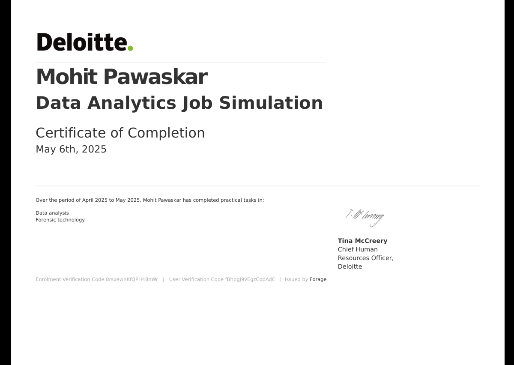
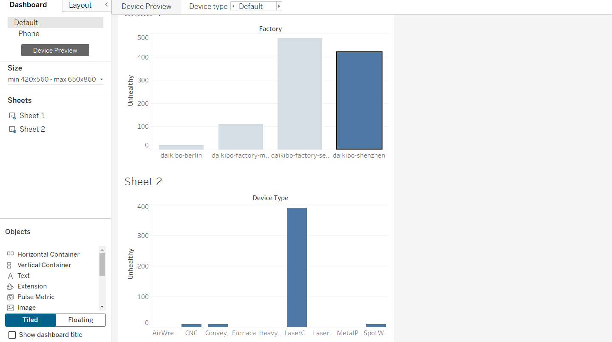

# 📊 Deloitte Data Analytics Project  
**Project by:** *Mohit Pawaskar*  
**Organization:** @Forage | @Deloitte  
**Tools Used:** Tableau, Microsoft Excel  

---

## 🎓 Certificate of Completion  
  

---

## 📌 Overview  

This project was completed as part of the **Deloitte Data Analytics Virtual Internship** offered by **Forage**. It focuses on two core business problems using data visualization and spreadsheet-based classification techniques.

---

## 🧹 TASK 1 – **Telemetry Data Visualization in Tableau**

### 🔹 01. Dataset
- File: `daikibo-telemetry-data.json` (imported into Tableau after unzipping)

### 🔹 02. Objective
Analyze telemetry data from multiple factories to determine downtime patterns across devices and locations.

### 🔹 03. Steps Completed
- Installed Tableau and set up a workspace.
- Imported the JSON telemetry data into Tableau.
- Created a **calculated measure field** named `"Unhealthy"` where each "Unhealthy" status = 10 minutes of downtime.
- Built the following visualizations:
  - **Bar Chart:** "Down Time per Factory"
  - **Bar Chart:** "Down Time per Device Type"
- Created an interactive **Dashboard**:
  - Linked both visualizations.
  - Enabled filtering: selecting a factory shows device-level downtime for that factory.
- Captured a **screenshot** of the dashboard with the **most downtime factory selected**.

### 📷 Dashboard Snapshot

---

## 🧮 TASK 2 – **Equality Score Classification in Excel**

### 🔹 01. Dataset
- File: `Equality Table.xlsx` containing:
  - Factory  
  - Job Role  
  - Equality Score  

### 🔹 02. Objective
Classify equality scores to detect fairness in employee compensation across roles and locations.

### 🔹 03. Classification Logic
Added a **new column**: `Equality Class` using the following rule set:

| Score Range         | Classification          |
|---------------------|--------------------------|
| -10 to +10          | Fair                     |
| <-10 or >10         | Unfair                   |
| <-20 or >20         | Highly Discriminative    |

### 🔹 04. Example Mappings:
- Score `10` → Fair  
- Score `-9` → Unfair  
- Score `-30` → Highly Discriminative  

The edited Excel file was submitted with the additional classification column.

---

## 🚀 Tools & Technologies Used
- **Data Visualization:** Tableau Desktop  
- **Spreadsheet Analysis:** Microsoft Excel  
- **Other Tools:** Screenshot Editor, File Compression Tools

---

## 📊 Results & Deliverables
- ✅ Interactive Tableau Dashboard with factory-wise and device-wise downtime analytics.
- ✅ Classified Equality Score Excel file for internal compensation review.

---

## 💡 Conclusion
This project provided hands-on experience with data visualization and equality analysis, emphasizing both technical proficiency and real-world business insight. The dashboards and Excel classifications enable better decision-making regarding operational performance and employee equity.

---

## 📄 License  
This project is licensed under the MIT License – see the [LICENSE](LICENSE) file for details.
